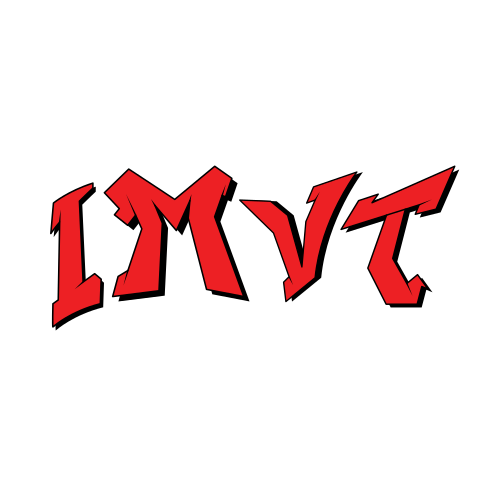
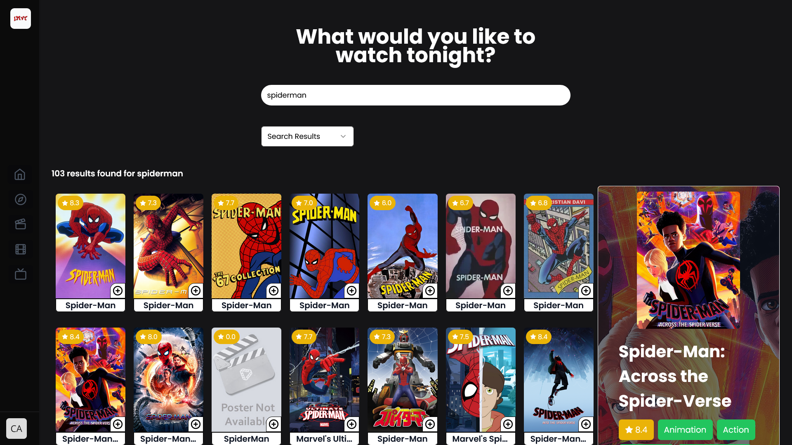
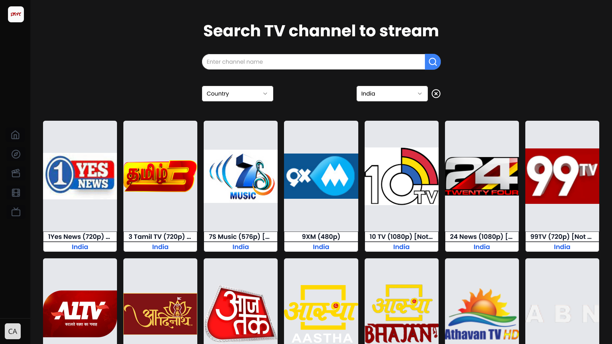
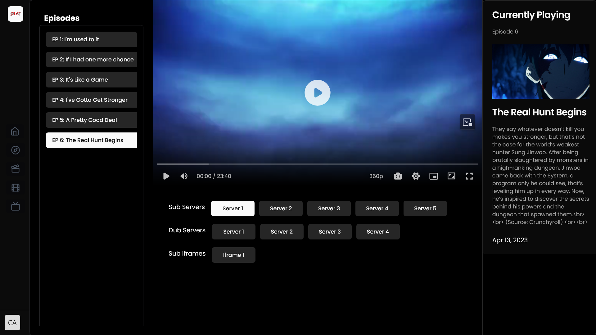
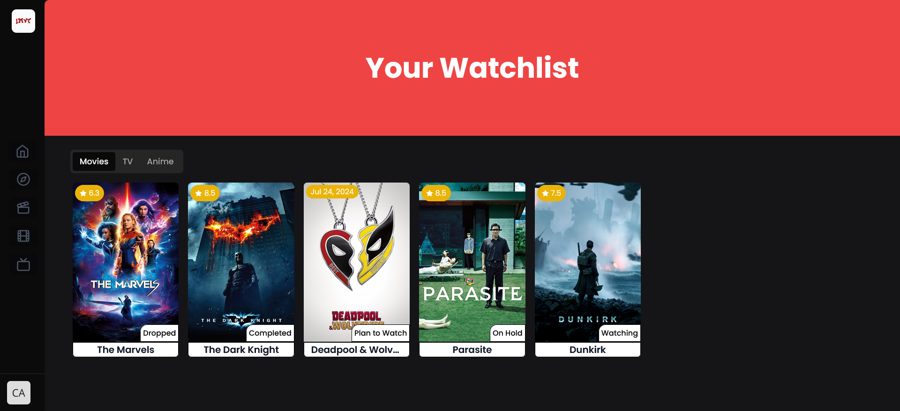

<a name="readme-top"></a>

<!-- PROJECT LOGO -->
<br />
<div align="center">
  <a href="https://github.com/VISHWAJ33T/imvt-client">
    
  </a>

<!--  -->

<h2 align="center">IMVT</h2>
  <p align="center">
    A web app for exploring, watching movies, tv shows, Live TV and anime built with Nextjs.
    <br />
  </p>
</div>
<br/>

<!-- <div align="center">
  <a href="https://github.com/VISHWAJ33T/imvt-client">
    
  </a>
</div>
<br/> -->

<!-- TECH STACK -->

## Tech Stack

- **Nextjs** with Typescript
- Authentication, database using **Prisma and Supabase**
- **Yoga Graphql with pothos** for Graphql Backend
- **Apollo Client** for Graphql frontend
- Styled using **TailwindCSS**
- **Shadcn** for pre-made components and themes
- Animation using **Framer Motion**
- **Embla Carousel** for touch slider
- State management using **Zustand**
- **Zod** for Validation
- Custom media player using **Artplayer**

<p align="right">(<a href="#readme-top">back to top</a>)</p>

### Features:

**Vast Library:** Discover a massive collection of content powered by multiple APIs, all in one place.


**Intuitive Search:** Find your next favorite title with ease using keyword, genre, cast, and more.

- **Search Media:**



- **Search TV Channel:**



**Detailed Information:** Each title comes with a dedicated page featuring synopsis, cast, crew, ratings, reviews, and trailers.


**Seamless Streaming:** Enjoy smooth playback directly on our platform or navigate to external streaming services.

- **Media Player:**
  

- **Live TV Player:**
  

**Personalized Watchlist:** Organize your media journey with custom lists for completed, watching, on hold, dropped, and plan-to-watch titles.



**Responsive Design:** Access your watchlist and explore content seamlessly on any device.

<div align="start">
  <a >
    
  </a>
</div>

<!--  -->

**API Integration:** Leverage the power of various APIs for accurate and up-to-date information.

<p align="right">(<a href="#readme-top">back to top</a>)</p>

## Development

<br/>

1. Install dependencies using pnpm

```sh
npm install
```

2. Copy `.env-example` and update the variables

3. Start the development server

```sh
npm run dev
```

<p align="right">(<a href="#readme-top">back to top</a>)</p>

<!-- LICENSE -->

## License

Distributed under the MIT License. See [LICENSE.txt](https://github.com/VISHWAJ33T/imvt-client/blob/master/LICENSE.txt) for more information.

<p align="right">(<a href="#readme-top">back to top</a>)</p>
